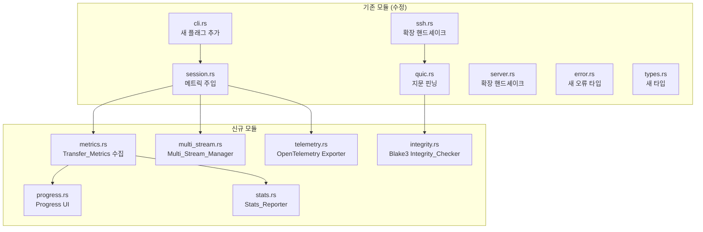

# Design Document: quicsync Phase 2/3 기능 확장

## Overview

기존 Phase 1 MVP(단일 QUIC 스트림 기반 rsync 터널)에 4가지 기능을 추가한다:

1. **macOS 플랫폼 지원**: 크로스 컴파일 타겟 추가 및 플랫폼 조건부 코드 처리
2. **Progress UI**: 전송 중 속도/ETA/모드를 터미널에 실시간 표시
3. **멀티스트림 병렬 전송**: QUIC 멀티스트림으로 파일 병렬 전송
4. **관측성(Observability)**: `--stats` 리포트, JSON 출력, OpenTelemetry 트레이싱
5. **보안 강화**: 인증서 지문 핀닝 + Blake3 무결성 검사

기존 코드의 인터페이스를 최대한 유지하면서 확장한다. 핵심 원칙:

- 기존 `Session::start()` → `Session::run()` 흐름을 유지하되, 메트릭 수집과 Progress UI를 주입
- 멀티스트림은 기존 단일 스트림 경로와 공존 (단일 파일 전송 시 기존 경로 사용)
- 보안 기능은 기본 활성화, `--no-integrity` 등으로 비활성화 가능

### 확장 후 데이터 흐름

```
quicsync -avz --stats --streams 4 /local/ user@remote:/remote/

  ├─ 1. SSH → Remote_Server (확장된 핸드셰이크: 포트+토큰+지문)
  ├─ 2. QUIC 연결 수립 + 인증서 지문 핀닝 검증
  ├─ 3. TCP_Proxy 바인딩
  ├─ 4. rsync 실행
  │
  │  rsync ←TCP→ TCP_Proxy ←Buffer→ QUIC_Tunnel ←QUIC→ Remote_Server ←TCP→ rsync(server)
  │                                    │ (N streams)
  │                                    ├─ Stream 1: file_a (Blake3 체크섬 포함)
  │                                    ├─ Stream 2: file_b
  │                                    ├─ Stream 3: file_c
  │                                    └─ Stream 4: file_d
  │
  │  [Progress UI: 45.2 MB/s | ETA 2m 13s | QUIC | 1.2 GB / 3.4 GB]
  │
  ├─ 5. 전송 완료 → Stats 리포트 출력
  └─ 6. OpenTelemetry span 전송 (활성화 시)
```

## Architecture

### 모듈 구조 확장



### 설계 결정 사항

1. **메트릭 수집은 `Arc<TransferMetrics>`로 공유**: Progress UI, Stats Reporter, OpenTelemetry가 동일한 메트릭 객체를 참조한다. `AtomicU64` 기반으로 lock-free 업데이트.

2. **멀티스트림은 rsync 레벨이 아닌 QUIC 레벨에서 동작**: rsync 자체는 단일 스트림으로 동작하되, 향후 파일 목록 기반 병렬 전송을 위한 인프라를 구축한다. 현재 Phase에서는 rsync의 `--files-from` 옵션과 결합하여 파일 단위 병렬화를 구현한다.

3. **Progress UI는 stderr에 출력**: stdout은 rsync 출력용으로 예약. Progress UI는 `\r` 캐리지 리턴으로 같은 줄을 갱신하는 방식.

4. **Blake3 무결성 검사는 청크 단위**: 각 QUIC write 단위(최대 64KB)마다 32바이트 Blake3 해시를 앞에 붙여 전송. 수신 측에서 재계산하여 비교.

5. **인증서 지문 핀닝은 기존 `SkipServerVerification`을 대체**: Phase 1의 "모든 인증서 허용" 방식을 "SSH로 전달받은 지문과 일치하는 인증서만 허용"으로 강화.

6. **OpenTelemetry는 선택적 의존성**: `--otel-endpoint` 미지정 시 초기화하지 않아 오버헤드 제로.

## Components and Interfaces

### 1. CLI 확장 (`src/cli.rs` 수정)

기존 `CliArgs`에 새 필드를 추가한다.

```rust
/// 확장된 CLI 인수
pub struct CliArgs {
    // 기존 필드
    pub local_path: PathBuf,
    pub remote: RemoteSpec,
    pub rsync_options: Vec<String>,
    pub direction: TransferDirection,

    // Phase 2/3 신규 필드
    pub show_progress: bool,       // --no-progress로 비활성화 (기본: 터미널이면 true)
    pub streams: u8,               // --streams N (기본: 4, 범위: 1-64)
    pub stats: bool,               // --stats
    pub stats_format: StatsFormat,  // --stats-format json|text (기본: text)
    pub otel_endpoint: Option<String>, // --otel-endpoint URL
    pub no_integrity: bool,        // --no-integrity (기본: false, 즉 무결성 검사 활성)
}

pub enum StatsFormat {
    Text,
    Json,
}
```

### 2. Transfer Metrics (`src/metrics.rs` 신규)

lock-free 메트릭 수집기. 모든 컴포넌트가 `Arc<TransferMetrics>`를 공유한다.

```rust
use std::sync::atomic::{AtomicU64, Ordering};
use std::time::Instant;

/// 전송 중 수집되는 성능 메트릭 (lock-free)
pub struct TransferMetrics {
    pub bytes_transferred: AtomicU64,
    pub total_bytes: AtomicU64,
    pub start_time: Instant,

    // RTT 통계 (마이크로초 단위)
    pub rtt_sum_us: AtomicU64,
    pub rtt_count: AtomicU64,
    pub rtt_min_us: AtomicU64,
    pub rtt_max_us: AtomicU64,

    // 큐/backpressure
    pub max_queue_depth: AtomicU64,
    pub backpressure_count: AtomicU64,

    // 스트림
    pub active_streams: AtomicU64,
    pub completed_streams: AtomicU64,
    pub failed_streams: AtomicU64,

    // 무결성
    pub integrity_chunks_verified: AtomicU64,
    pub integrity_bytes_verified: AtomicU64,

    // 전송 모드
    pub transport_mode: AtomicU64, // 0=QUIC, 1=TCP (향후 폴백용)
}

impl TransferMetrics {
    pub fn new() -> Self;

    /// 현재 전송 속도 (bytes/sec) 계산
    pub fn throughput_bps(&self) -> f64;

    /// 예상 완료 시간 (초) 계산
    pub fn eta_secs(&self) -> Option<f64>;

    /// RTT 통계 스냅샷
    pub fn rtt_snapshot(&self) -> RttStats;

    /// 최종 리포트용 스냅샷 생성
    pub fn snapshot(&self) -> MetricsSnapshot;
}

/// RTT 통계 스냅샷
pub struct RttStats {
    pub avg_us: f64,
    pub min_us: u64,
    pub max_us: u64,
}

/// 최종 리포트용 불변 스냅샷
pub struct MetricsSnapshot {
    pub bytes_transferred: u64,
    pub duration_secs: f64,
    pub throughput_bps: f64,
    pub rtt: RttStats,
    pub max_queue_depth: u64,
    pub backpressure_count: u64,
    pub streams_completed: u64,
    pub streams_failed: u64,
    pub integrity_chunks: u64,
    pub integrity_bytes: u64,
}
```

### 3. Progress UI (`src/progress.rs` 신규)

터미널에 전송 상태를 실시간 표시한다.

```rust
use std::sync::Arc;
use crate::metrics::TransferMetrics;

pub struct ProgressUI {
    metrics: Arc<TransferMetrics>,
    enabled: bool,
}

impl ProgressUI {
    pub fn new(metrics: Arc<TransferMetrics>, enabled: bool) -> Self;

    /// 500ms 주기로 터미널에 상태를 갱신하는 루프 (tokio task로 실행)
    pub async fn run(&self);
}

/// 바이트 수를 사람이 읽기 쉬운 단위로 변환
/// 예: 1536 → "1.5 KB", 1073741824 → "1.0 GB"
pub fn format_bytes(bytes: u64) -> String;

/// 전송 속도를 사람이 읽기 쉬운 단위로 변환
/// 예: 1536.0 → "1.5 KB/s", 1073741824.0 → "1.0 GB/s"
pub fn format_speed(bytes_per_sec: f64) -> String;

/// 초를 사람이 읽기 쉬운 시간으로 변환
/// 예: 133.0 → "2m 13s", 3661.0 → "1h 1m 1s"
pub fn format_eta(secs: f64) -> String;

```

### 4. Stats Reporter (`src/stats.rs` 신규)

전송 완료 후 성능 리포트를 출력한다.

```rust
use crate::metrics::MetricsSnapshot;

pub struct StatsReporter {
    format: StatsFormat,
}

impl StatsReporter {
    pub fn new(format: StatsFormat) -> Self;

    /// 성능 리포트를 stderr에 출력
    pub fn report(&self, snapshot: &MetricsSnapshot);
}

/// MetricsSnapshot을 JSON 문자열로 직렬화
pub fn to_json(snapshot: &MetricsSnapshot) -> String;

/// JSON 문자열을 MetricsSnapshot으로 역직렬화
pub fn from_json(json: &str) -> Result<MetricsSnapshot, serde_json::Error>;
```

`serde` + `serde_json`을 사용하여 `MetricsSnapshot`의 직렬화/역직렬화를 구현한다.

### 5. Multi Stream Manager (`src/multi_stream.rs` 신규)

QUIC 멀티스트림 기반 병렬 전송을 관리한다.

```rust
use quinn::Connection;
use std::sync::Arc;
use crate::metrics::TransferMetrics;

pub struct MultiStreamManager {
    connection: Connection,
    max_streams: u8,
    metrics: Arc<TransferMetrics>,
}

/// 개별 스트림의 전송 결과
pub struct StreamResult {
    pub stream_id: usize,
    pub success: bool,
    pub bytes_transferred: u64,
    pub error: Option<String>,
}

/// 전체 병렬 전송 결과
pub struct MultiStreamReport {
    pub results: Vec<StreamResult>,
    pub total_success: usize,
    pub total_failed: usize,
}

impl MultiStreamManager {
    pub fn new(connection: Connection, max_streams: u8, metrics: Arc<TransferMetrics>) -> Self;

    /// 파일 목록을 받아 병렬 전송 실행
    /// max_streams 개의 동시 스트림으로 제한하며, 세마포어로 제어
    pub async fn transfer_files(&self, files: Vec<FileEntry>) -> MultiStreamReport;
}

/// 전송 대상 파일 정보
pub struct FileEntry {
    pub path: String,
    pub size: u64,
}
```

설계 노트: `tokio::sync::Semaphore`로 동시 스트림 수를 제한한다. 각 파일은 독립적인 QUIC 양방향 스트림에서 전송되며, 하나의 스트림 실패가 다른 스트림에 영향을 주지 않는다.

### 6. Integrity Checker (`src/integrity.rs` 신규)

Blake3 기반 전송 중 데이터 무결성 검사를 수행한다.

```rust
/// 데이터 청크에 Blake3 해시를 계산
pub fn compute_hash(data: &[u8]) -> [u8; 32];

/// 데이터와 해시를 검증
pub fn verify_hash(data: &[u8], expected: &[u8; 32]) -> bool;

/// 청크 프레이밍: [32바이트 해시][데이터] 형태로 인코딩
pub fn encode_chunk(data: &[u8]) -> Vec<u8>;

/// 청크 디프레이밍: [32바이트 해시][데이터]에서 데이터를 추출하고 해시를 검증
pub fn decode_chunk(frame: &[u8]) -> Result<Vec<u8>, IntegrityError>;
```

프레이밍 형식:
```
+------------------+------------------+
| Blake3 hash      | Data payload     |
| (32 bytes)       | (variable)       |
+------------------+------------------+
```

설계 노트: `blake3` 크레이트를 사용한다. Blake3는 SIMD 최적화가 내장되어 있어 SHA-256 대비 수배 빠르다. 무결성 검사 비활성화 시(`--no-integrity`) 프레이밍 없이 원본 데이터를 직접 전송한다.

### 7. Session Pinning (`src/quic.rs` 수정)

기존 `SkipServerVerification`을 `FingerprintVerifier`로 대체한다.

```rust
/// 인증서 지문 기반 검증기
/// SSH 핸드셰이크로 수신한 지문과 서버 인증서 지문을 비교
struct FingerprintVerifier {
    expected_fingerprint: [u8; 32], // SHA-256
}

impl ServerCertVerifier for FingerprintVerifier {
    fn verify_server_cert(&self, end_entity: &CertificateDer, ...) -> Result<...> {
        let actual = sha256_fingerprint(end_entity);
        if constant_time_eq(&actual, &self.expected_fingerprint) {
            Ok(ServerCertVerified::assertion())
        } else {
            Err(rustls::Error::General("certificate fingerprint mismatch".into()))
        }
    }
}

/// 인증서의 SHA-256 지문 계산
pub fn sha256_fingerprint(cert: &[u8]) -> [u8; 32];

/// SHA-256 지문을 hex 문자열로 변환
pub fn fingerprint_to_hex(fp: &[u8; 32]) -> String;

/// hex 문자열을 SHA-256 지문으로 변환
pub fn fingerprint_from_hex(s: &str) -> Result<[u8; 32], FingerprintError>;
```

### 8. 확장된 핸드셰이크 (`src/ssh.rs` 수정)

핸드셰이크 프로토콜에 인증서 지문 필드를 추가한다.

```
QUICSYNC_READY <port> <token> <fingerprint>\n
```

- `fingerprint`: 서버 인증서의 SHA-256 지문 (64자 hex)

`parse_handshake`를 확장하여 3필드(기존)와 4필드(신규) 모두 파싱 가능하게 한다. 3필드인 경우 지문 검증을 건너뛴다(하위 호환).

```rust
pub struct HandshakeInfo {
    pub port: u16,
    pub token: String,
    pub fingerprint: Option<String>, // Phase 2에서 추가, None이면 핀닝 비활성
}

pub fn parse_handshake(stdout_line: &str) -> Result<HandshakeInfo, SshError>;
```

### 9. OpenTelemetry Exporter (`src/telemetry.rs` 신규)

OpenTelemetry 트레이싱을 관리한다.

```rust
use std::sync::Arc;
use crate::metrics::TransferMetrics;

pub struct TelemetryExporter {
    endpoint: String,
}

impl TelemetryExporter {
    /// OpenTelemetry 초기화 (TracerProvider 설정)
    pub fn init(endpoint: &str) -> Result<Self, TelemetryError>;

    /// 루트 span 생성
    pub fn start_session_span(&self, args: &CliArgs) -> SessionSpan;

    /// 종료 및 flush
    pub fn shutdown(self);
}

pub struct SessionSpan { /* tracing span wrapper */ }

impl SessionSpan {
    pub fn ssh_span(&self) -> ChildSpan;
    pub fn quic_span(&self) -> ChildSpan;
    pub fn transfer_span(&self, metrics: &Arc<TransferMetrics>) -> ChildSpan;
}
```

설계 노트: `opentelemetry` + `opentelemetry-otlp` + `tracing-opentelemetry` 크레이트를 사용한다. 기존 `tracing` 인프라와 자연스럽게 통합된다. `--otel-endpoint` 미지정 시 `TelemetryExporter`를 생성하지 않아 런타임 오버헤드가 없다.

## Data Models

### 확장된 핸드셰이크 프로토콜

```
QUICSYNC_READY <port> <token> [<fingerprint>]\n
```

| 필드 | 타입 | 설명 |
|------|------|------|
| `port` | u16 | Remote_Server UDP 포트 (1-65535) |
| `token` | hex string (64자) | 32바이트 인증 토큰 |
| `fingerprint` | hex string (64자, 선택) | 서버 인증서 SHA-256 지문 |

하위 호환: `fingerprint` 필드가 없으면 기존 Phase 1 동작(지문 검증 없음).

### Transfer_Metrics JSON 스키마

```json
{
  "bytes_transferred": 3670016000,
  "duration_secs": 81.2,
  "throughput_bps": 45185000.0,
  "rtt": {
    "avg_us": 45200.0,
    "min_us": 12000,
    "max_us": 98000
  },
  "max_queue_depth": 128,
  "backpressure_count": 3,
  "streams_completed": 42,
  "streams_failed": 0,
  "integrity_chunks": 56000,
  "integrity_bytes": 3670016000
}
```

### Blake3 청크 프레이밍

```
+------------------+------------------+
| Blake3 hash      | Data payload     |
| (32 bytes fixed) | (variable len)   |
+------------------+------------------+
```

무결성 검사 비활성화 시 프레이밍 없이 원본 데이터만 전송.

### 새 오류 타입

```rust
// error.rs에 추가
pub enum IntegrityError {
    HashMismatch { expected: String, actual: String },
    FrameTooShort(usize),
}

pub enum FingerprintError {
    InvalidHex(String),
    InvalidLength(usize),
    Mismatch { expected: String, actual: String },
}

pub enum StatsError {
    SerializationFailed(String),
    DeserializationFailed(String),
}

pub enum TelemetryError {
    InitFailed(String),
    ExportFailed(String),
}

pub enum MultiStreamError {
    StreamFailed { stream_id: usize, error: String },
    InvalidStreamCount(u8),
}
```

### 새 의존성 (Cargo.toml 추가)

```toml
[dependencies]
# Phase 2/3 신규
blake3 = "1"
serde = { version = "1", features = ["derive"] }
serde_json = "1"
indicatif = "0.17"  # Progress bar (선택적, format_* 함수 직접 구현도 가능)

# OpenTelemetry (optional feature로 관리)
opentelemetry = { version = "0.27", optional = true }
opentelemetry-otlp = { version = "0.27", optional = true }
opentelemetry_sdk = { version = "0.27", optional = true }
tracing-opentelemetry = { version = "0.28", optional = true }

[features]
default = []
otel = ["opentelemetry", "opentelemetry-otlp", "opentelemetry_sdk", "tracing-opentelemetry"]
```

설계 노트: OpenTelemetry 의존성은 `otel` feature flag로 관리하여, 불필요한 경우 바이너리 크기를 줄인다. `--otel-endpoint` 사용 시 `cargo build --features otel`로 빌드해야 한다.


## Correctness Properties

*A property is a characteristic or behavior that should hold true across all valid executions of a system — essentially, a formal statement about what the system should do. Properties serve as the bridge between human-readable specifications and machine-verifiable correctness guarantees.*

### Property 1: 바이트/속도 포맷 함수 정확성

*For any* 0 이상의 바이트 수(u64)에 대해, `format_bytes`는 올바른 단위(B, KB, MB, GB)를 선택하고 값을 정확히 변환해야 한다. 구체적으로: 0-999 → B, 1000-999999 → KB, 1000000-999999999 → MB, 1000000000+ → GB. 마찬가지로 *for any* 0 이상의 전송 속도(f64)에 대해, `format_speed`는 동일한 단위 선택 규칙을 적용하고 "/s" 접미사를 포함해야 한다.

**Validates: Requirements 2.8, 2.9**

### Property 2: --streams 옵션 파싱 정확성

*For any* 1-64 범위의 정수 N에 대해, `--streams N` 옵션을 포함한 CLI 인수를 파싱하면 `streams` 필드가 N으로 설정되어야 한다. *For any* 0 또는 65-255 범위의 정수에 대해, 파싱은 유효 범위 오류를 반환해야 한다.

**Validates: Requirements 3.3, 3.4**

### Property 3: 스트림 결과 집계 정확성

*For any* `StreamResult` 목록에 대해, `MultiStreamReport`의 `total_success`는 `success == true`인 항목 수와 동일하고, `total_failed`는 `success == false`인 항목 수와 동일해야 한다. 또한 `total_success + total_failed`는 전체 목록 길이와 동일해야 한다.

**Validates: Requirements 3.6**

### Property 4: 텍스트 리포트 필수 필드 포함

*For any* 유효한 `MetricsSnapshot`에 대해, 텍스트 형식의 성능 리포트 문자열은 총 전송 바이트 수, 평균 처리량, 전송 소요 시간, 평균/최소/최대 RTT, 최대 큐 깊이, backpressure 발생 횟수를 모두 포함해야 한다.

**Validates: Requirements 4.2, 4.3, 4.4**

### Property 5: MetricsSnapshot JSON 라운드트립

*For any* 유효한 `MetricsSnapshot`에 대해, `to_json`으로 직렬화한 뒤 `from_json`으로 역직렬화하면 원래 값과 동일한 `MetricsSnapshot`이 복원되어야 한다.

**Validates: Requirements 4.7**

### Property 6: 확장 핸드셰이크 파싱 라운드트립

*For any* 유효한 UDP 포트(1-65535), 32바이트 인증 토큰, 32바이트 SHA-256 지문에 대해, `QUICSYNC_READY <port> <token_hex> <fingerprint_hex>` 형태로 직렬화한 뒤 `parse_handshake`로 파싱하면 원래의 포트, 토큰, 지문이 복원되어야 한다. 또한 지문 없는 3필드 형식(`QUICSYNC_READY <port> <token_hex>`)도 정상 파싱되어야 한다(하위 호환).

**Validates: Requirements 6.6**

### Property 7: 인증서 지문 계산 및 hex 인코딩

*For any* 임의의 바이트 시퀀스(인증서 DER 데이터)에 대해, `sha256_fingerprint`는 항상 32바이트 배열을 반환해야 한다. 또한 *for any* 32바이트 배열에 대해, `fingerprint_to_hex`는 64자 hex 문자열을 반환하고, `fingerprint_from_hex`로 역변환하면 원래 배열이 복원되어야 한다(라운드트립).

**Validates: Requirements 6.2, 6.5**

### Property 8: 인증서 지문 검증

*For any* 두 개의 32바이트 배열에 대해, 동일한 배열끼리 비교하면 검증이 성공하고, 서로 다른 배열끼리 비교하면 검증이 실패해야 한다. 이는 기존 Phase 1의 AuthToken 검증 패턴과 동일하다.

**Validates: Requirements 6.3, 6.4**

### Property 9: Blake3 청크 encode/decode 라운드트립

*For any* 임의의 바이트 시퀀스에 대해, `encode_chunk`로 인코딩한 뒤 `decode_chunk`로 디코딩하면 원래 데이터가 복원되어야 한다. 또한 인코딩된 프레임의 처음 32바이트는 원본 데이터의 Blake3 해시와 동일해야 한다.

**Validates: Requirements 7.1, 7.2, 7.4, 7.6**

### Property 10: Blake3 손상 감지

*For any* 임의의 바이트 시퀀스를 `encode_chunk`로 인코딩한 뒤, 데이터 영역(32바이트 이후)의 임의의 1바이트를 변경하면, `decode_chunk`는 `IntegrityError::HashMismatch`를 반환해야 한다.

**Validates: Requirements 7.3**

## Error Handling

### 새 오류 카테고리

기존 `QuicsyncError` enum에 새 variant를 추가한다:

```rust
pub enum QuicsyncError {
    // 기존 variant 유지
    Cli(CliError),
    Ssh(SshError),
    Proxy(ProxyError),
    Buffer(BufferError),
    Quic(QuicError),
    Server(ServerError),
    Rsync(RsyncError),
    Session(SessionError),

    // Phase 2/3 신규
    Integrity(IntegrityError),
    Fingerprint(FingerprintError),
    Stats(StatsError),
    Telemetry(TelemetryError),
    MultiStream(MultiStreamError),
}
```

### 오류 처리 전략

| 카테고리 | 동작 | 종료 코드 |
|----------|------|-----------|
| `--streams` 범위 오류 | 유효 범위(1-64) 안내 메시지 출력 | 1 |
| 인증서 지문 불일치 | 지문 불일치 오류 메시지 출력 + QUIC 연결 거부 | 1 |
| Blake3 무결성 오류 | 손상된 청크 정보 출력 + 전송 중단 | 1 |
| OpenTelemetry 연결 실패 | 경고 로그 기록, 전송은 계속 | (전송 종료 코드) |
| Stats JSON 직렬화 실패 | 경고 로그 기록, 텍스트 폴백 | (전송 종료 코드) |
| 개별 스트림 실패 | 해당 스트림만 종료, 나머지 계속 | (전송 종료 코드) |

핵심 원칙: 관측성 기능(Stats, OpenTelemetry)의 실패는 전송 자체를 중단하지 않는다. 보안 기능(지문 핀닝, 무결성 검사)의 실패는 즉시 전송을 중단한다.

## Testing Strategy

### 테스트 프레임워크

- 단위 테스트: Rust 내장 `#[test]` + `tokio::test`
- Property-based 테스트: `proptest` 크레이트 (최소 100회 반복)
- 통합 테스트: `tests/` 디렉토리

### Property-based 테스트 범위

각 correctness property에 대해 `proptest` 기반 테스트를 작성한다. 모든 property 테스트는 최소 100회 반복으로 설정한다.

| Property | 테스트 대상 | 생성기 |
|----------|------------|--------|
| Property 1 | `format_bytes`, `format_speed` | 임의 u64 (바이트), 임의 f64 (속도) |
| Property 2 | CLI `--streams` 파싱 | 임의 u8 (1-64 유효, 0/65+ 무효) |
| Property 3 | `MultiStreamReport` 집계 | 임의 `Vec<StreamResult>` |
| Property 4 | 텍스트 리포트 렌더링 | 임의 `MetricsSnapshot` |
| Property 5 | `to_json` / `from_json` | 임의 `MetricsSnapshot` |
| Property 6 | `parse_handshake` (확장) | 임의 u16 포트 + 32바이트 토큰 + 32바이트 지문 |
| Property 7 | `sha256_fingerprint`, `fingerprint_to_hex/from_hex` | 임의 바이트 시퀀스, 임의 32바이트 배열 |
| Property 8 | 지문 상수 시간 비교 | 임의 32바이트 배열 쌍 |
| Property 9 | `encode_chunk` / `decode_chunk` | 임의 바이트 시퀀스 (0-64KB) |
| Property 10 | `decode_chunk` 손상 감지 | 임의 바이트 시퀀스 + 임의 변조 위치 |

각 property 테스트에는 다음 형태의 태그 주석을 포함한다:

```rust
// Feature: quicsync-phase2-enhancements, Property 9: Blake3 청크 encode/decode 라운드트립
```

### 단위 테스트 범위

- CLI 새 플래그 파싱: `--no-progress`, `--stats`, `--stats-format`, `--otel-endpoint`, `--no-integrity`, `--streams`
- `format_bytes` / `format_speed` / `format_eta`: 경계값 예시 (0, 999, 1000, 999999, 1000000 등)
- 확장 핸드셰이크: 3필드(하위 호환) 및 4필드 파싱 예시
- Blake3: 빈 데이터, 단일 바이트, 대용량 데이터 해시 예시
- 지문: 알려진 인증서의 SHA-256 지문 검증

### 통합 테스트

- loopback 환경에서 멀티스트림 전송 후 파일 동일성 검증
- `--stats` 플래그로 JSON 리포트 출력 검증
- `--no-integrity` 플래그로 무결성 검사 비활성화 검증
- 인증서 지문 핀닝이 활성화된 상태에서 정상 연결 검증
