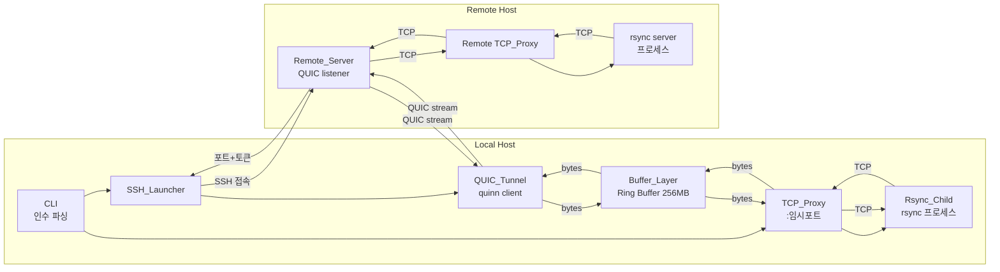

# Design Document: quicsync Tunnel MVP

## Overview

quicsync Phase 1 MVP는 rsync의 Delta-sync를 완전히 유지하면서, 장거리 네트워크(LFN)에서 QUIC(UDP) 기반 터널을 통해 전송 성능을 개선하는 단일 Rust 바이너리이다.

핵심 아이디어는 rsync 프로세스를 직접 수정하지 않고, rsync의 TCP 트래픽을 로컬에서 가로채어 QUIC 터널로 중계하는 "투명 프록시" 접근법이다. 이를 통해:

1. rsync의 Delta-sync 알고리즘을 100% 그대로 활용
2. TCP 윈도우 크기 제한을 무상태 버퍼링으로 우회
3. QUIC의 BBR 혼잡 제어로 LFN 대역폭을 최대한 활용

### 동작 흐름 요약

```
quicsync user@remote:/path /local/path
    │
    ├─ 1. SSH로 원격 quicsync server 실행 (포트+토큰 수신)
    ├─ 2. QUIC 터널 수립 (quinn, TLS 1.3, BBR)
    ├─ 3. 로컬 TCP 프록시 포트 바인딩
    ├─ 4. rsync 자식 프로세스 실행 (목적지 → 로컬 프록시)
    │
    │  rsync ←TCP→ TCP_Proxy ←Buffer→ QUIC_Tunnel ←QUIC→ Remote_Server ←TCP→ rsync(server)
    │
    └─ 5. 전송 완료 → 리소스 정리
```

## Architecture

### 시스템 구성도



### 설계 결정 사항

1. **단일 바이너리, 이중 역할**: 동일한 `quicsync` 바이너리가 CLI 모드(로컬)와 `--server` 모드(원격)로 동작한다. 배포 단순화를 위한 결정이다.

2. **SSH를 인증 채널로 활용**: 별도 PKI/인증서 관리 없이 기존 SSH 인프라를 그대로 활용한다. QUIC 연결용 일회성 토큰을 SSH stdout으로 교환한다.

3. **무상태 버퍼링으로 TCP/QUIC 속도 단절**: TCP_Proxy가 rsync에 즉각 ACK를 반환하여 TCP 윈도우가 항상 열려 있게 유지한다. 이것이 LFN 성능 개선의 핵심이다.

4. **양방향 프록시**: rsync 프로토콜은 단방향이 아니라 핸드셰이크/협상 패킷이 오가는 양방향 프로토콜이다. 따라서 TCP_Proxy와 Remote_Server 모두 양방향 데이터 중계를 지원해야 한다.

5. **BBR 혼잡 제어 기본 적용**: LFN에서 CUBIC보다 BBR이 대역폭 활용률이 높다. quinn의 congestion control 설정으로 BBR을 기본 적용한다.

## Components and Interfaces

### 1. CLI (`src/cli.rs`)

인수 파싱 및 전체 세션 오케스트레이션을 담당한다.

```rust
/// CLI 인수 파싱 결과
pub struct CliArgs {
    pub local_path: PathBuf,
    pub remote: RemoteSpec,
    pub rsync_options: Vec<String>,
    pub direction: TransferDirection,
}

/// 원격 경로 파싱 결과
pub struct RemoteSpec {
    pub user: Option<String>,
    pub host: String,
    pub path: String,
}

pub enum TransferDirection {
    Push,  // 로컬 → 원격
    Pull,  // 원격 → 로컬
}

/// CLI 진입점
pub async fn run(args: CliArgs) -> Result<i32, QuicsyncError>;

/// 인수 파싱
pub fn parse_args(args: &[String]) -> Result<CliArgs, CliError>;

/// 원격 경로 파싱
pub fn parse_remote(path: &str) -> Result<RemoteSpec, CliError>;
```

### 2. SSH_Launcher (`src/ssh.rs`)

SSH를 통한 원격 서버 실행 및 핸드셰이크를 담당한다.

```rust
/// SSH 핸드셰이크 결과
pub struct SshHandshake {
    pub remote_port: u16,
    pub auth_token: String,
    pub ssh_process: Child,
}

/// 원격 서버 실행
pub async fn launch_remote_server(
    remote: &RemoteSpec,
) -> Result<SshHandshake, SshError>;

/// SSH stdout에서 포트+토큰 파싱
fn parse_handshake(stdout_line: &str) -> Result<(u16, String), SshError>;
```

핸드셰이크 프로토콜: Remote_Server가 시작되면 SSH stdout으로 `QUICSYNC_READY <port> <token>\n` 형태의 한 줄을 출력한다. SSH_Launcher는 이 줄을 파싱하여 QUIC 연결에 필요한 정보를 추출한다.

### 3. TCP_Proxy (`src/tcp_proxy.rs`)

로컬 TCP 리스닝 및 양방향 바이트 스트림 중계를 담당한다.

```rust
pub struct TcpProxy {
    listener: TcpListener,
    port: u16,
}

impl TcpProxy {
    /// 임시 포트에 바인딩
    pub async fn bind() -> Result<Self, ProxyError>;

    /// 바인딩된 포트 번호 반환
    pub fn port(&self) -> u16;

    /// rsync 연결 수락 후 양방향 중계 시작
    /// tcp_to_quic: TCP에서 읽은 데이터를 Buffer_Layer로 전달하는 채널
    /// quic_to_tcp: QUIC에서 수신한 데이터를 TCP로 전달하는 채널
    pub async fn relay(
        self,
        tcp_to_quic: mpsc::Sender<Bytes>,
        quic_to_tcp: mpsc::Receiver<Bytes>,
    ) -> Result<(), ProxyError>;
}
```

### 4. Buffer_Layer (`src/buffer.rs`)

Ring Buffer 기반 무상태 버퍼링 및 backpressure 제어를 담당한다.

```rust
pub struct BufferLayer {
    buffer: RingBuffer,
    capacity: usize,
    backpressure_threshold: usize,
    resume_threshold: usize,
}

pub struct RingBuffer {
    data: Vec<u8>,
    head: usize,
    tail: usize,
    len: usize,
    capacity: usize,
}

impl RingBuffer {
    pub fn new(capacity: usize) -> Self;
    pub fn write(&mut self, data: &[u8]) -> Result<usize, BufferFull>;
    pub fn read(&mut self, buf: &mut [u8]) -> usize;
    pub fn len(&self) -> usize;
    pub fn is_empty(&self) -> bool;
    pub fn is_full(&self) -> bool;
    pub fn available(&self) -> usize;
}

impl BufferLayer {
    pub fn new(capacity: usize) -> Self;
    pub fn from_env() -> Self; // QUICSYNC_BUFFER_SIZE 환경변수 참조

    /// TCP → Buffer → QUIC 방향 비동기 중계
    pub async fn relay_forward(
        &self,
        tcp_rx: mpsc::Receiver<Bytes>,
        quic_tx: SendStream,
    ) -> Result<(), BufferError>;

    /// QUIC → Buffer → TCP 방향 비동기 중계 (역방향)
    pub async fn relay_reverse(
        &self,
        quic_rx: RecvStream,
        tcp_tx: mpsc::Sender<Bytes>,
    ) -> Result<(), BufferError>;

    pub fn is_backpressure_active(&self) -> bool;
}
```

설계 노트: 실제 구현에서 Buffer_Layer는 tokio 채널 기반 비동기 파이프라인으로 동작한다. `relay_forward`와 `relay_reverse`는 각각 독립적인 tokio task로 실행되어 양방향 데이터 흐름을 동시에 처리한다. Backpressure는 Ring_Buffer가 가득 찼을 때 TCP_Proxy의 `mpsc::Sender`에 대한 `send().await`가 자연스럽게 블로킹되는 방식으로 구현한다.

### 5. QUIC_Tunnel (`src/quic.rs`)

quinn 기반 QUIC 연결 수립 및 스트림 관리를 담당한다.

```rust
pub struct QuicTunnel {
    connection: quinn::Connection,
}

/// QUIC 클라이언트 설정
pub struct QuicClientConfig {
    pub remote_addr: SocketAddr,
    pub auth_token: String,
    pub server_name: String,
}

impl QuicTunnel {
    /// QUIC 연결 수립 (클라이언트 측)
    pub async fn connect(config: QuicClientConfig) -> Result<Self, QuicError>;

    /// 양방향 스트림 열기
    pub async fn open_bi_stream(
        &self,
    ) -> Result<(SendStream, RecvStream), QuicError>;

    /// 연결 종료
    pub async fn close(self) -> Result<(), QuicError>;
}

/// quinn Endpoint 설정 (BBR 혼잡 제어, TLS 1.3)
pub fn build_client_endpoint() -> Result<quinn::Endpoint, QuicError>;
pub fn build_server_endpoint(
    bind_addr: SocketAddr,
    tls_config: ServerConfig,
) -> Result<quinn::Endpoint, QuicError>;

/// 자체 서명 인증서 생성 (일회성 세션용)
pub fn generate_self_signed_cert() -> Result<(CertificateDer, PrivateKeyDer), QuicError>;
```

설계 노트: TLS 인증서는 세션마다 자체 서명 인증서를 생성한다. SSH 채널을 통해 교환된 인증 토큰으로 상호 인증하므로, 인증서 자체의 신뢰 체인은 불필요하다. BBR 혼잡 제어는 `quinn::TransportConfig`의 `congestion_controller_factory`를 통해 설정한다.

### 6. Remote_Server (`src/server.rs`)

원격 측 QUIC 리스너 및 역방향 TCP 프록시를 담당한다.

```rust
pub struct RemoteServer {
    endpoint: quinn::Endpoint,
    port: u16,
    auth_token: String,
}

impl RemoteServer {
    /// 서버 시작 (UDP 포트 바인딩 + QUIC 리스닝)
    pub async fn start() -> Result<Self, ServerError>;

    /// stdout으로 핸드셰이크 정보 출력
    pub fn emit_handshake(&self);

    /// 연결 수락 및 처리 루프
    pub async fn accept_and_serve(self) -> Result<i32, ServerError>;

    /// 인증 토큰 검증
    fn verify_token(&self, token: &str) -> bool;
}

/// 원격 rsync 서버 프로세스 실행
pub async fn spawn_rsync_server(
    rsync_args: &[String],
) -> Result<Child, ServerError>;
```

### 7. Rsync_Child (`src/rsync.rs`)

rsync 자식 프로세스 실행 및 관리를 담당한다.

```rust
pub struct RsyncChild {
    process: Child,
}

impl RsyncChild {
    /// rsync 자식 프로세스 실행
    /// proxy_port를 사용하여 원격 목적지를 로컬 프록시로 리다이렉션
    pub fn spawn(
        rsync_options: &[String],
        local_path: &Path,
        remote: &RemoteSpec,
        proxy_port: u16,
        direction: TransferDirection,
    ) -> Result<Self, RsyncError>;

    /// rsync 종료 대기 및 종료 코드 반환
    pub async fn wait(self) -> Result<i32, RsyncError>;
}
```

설계 노트: rsync의 `-e` 옵션을 활용하여 원격 셸 대신 `localhost:<proxy_port>`로 연결하도록 리다이렉션한다. 구체적으로 rsync의 `--rsh` 옵션에 netcat 또는 커스텀 커넥터를 지정하여 TCP_Proxy 포트로 연결을 강제한다.

### 8. Session Orchestrator (`src/session.rs`)

전체 세션 생명주기 관리 및 시그널 핸들링을 담당한다.

```rust
pub struct Session {
    ssh: SshHandshake,
    tunnel: QuicTunnel,
    proxy: TcpProxy,
    rsync: RsyncChild,
}

impl Session {
    /// 세션 시작 (모든 컴포넌트 초기화)
    pub async fn start(args: CliArgs) -> Result<Self, SessionError>;

    /// 세션 실행 (전송 완료까지 대기)
    pub async fn run(self) -> Result<i32, SessionError>;

    /// 정상 종료
    async fn shutdown(self) -> Result<(), SessionError>;

    /// 비정상 종료 (시그널 또는 오류)
    async fn abort(self, reason: &str) -> Result<(), SessionError>;
}

/// SIGINT/SIGTERM 핸들러 등록
pub fn install_signal_handlers() -> Result<tokio::sync::watch::Receiver<bool>, SessionError>;
```

## Data Models

### 핸드셰이크 프로토콜

SSH stdout을 통한 단순 텍스트 프로토콜:

```
QUICSYNC_READY <port> <token>\n
```

- `port`: Remote_Server가 바인딩한 UDP 포트 번호 (u16)
- `token`: 64바이트 hex 인코딩된 랜덤 인증 토큰

예시: `QUICSYNC_READY 45231 a1b2c3d4...f0\n`

### 인증 토큰

```rust
/// 32바이트 랜덤 토큰 (hex 인코딩 시 64자)
pub struct AuthToken([u8; 32]);

impl AuthToken {
    pub fn generate() -> Self;
    pub fn to_hex(&self) -> String;
    pub fn from_hex(s: &str) -> Result<Self, TokenError>;
    pub fn verify(&self, other: &Self) -> bool;
}
```

QUIC 연결 수립 시 클라이언트가 첫 번째 스트림으로 토큰을 전송하고, Remote_Server가 이를 검증한다. 토큰이 일치하지 않으면 연결을 즉시 종료한다.

### 환경변수 설정

| 환경변수 | 기본값 | 설명 |
|----------|--------|------|
| `QUICSYNC_BUFFER_SIZE` | `268435456` (256MB) | Ring_Buffer 크기 (바이트) |
| `QUICSYNC_LOG` | `warn` | 로그 레벨 (trace/debug/info/warn/error) |

### 오류 타입 계층

```rust
pub enum QuicsyncError {
    Cli(CliError),
    Ssh(SshError),
    Proxy(ProxyError),
    Buffer(BufferError),
    Quic(QuicError),
    Server(ServerError),
    Rsync(RsyncError),
    Session(SessionError),
}

pub enum CliError {
    InvalidArgs(String),
    InvalidRemotePath(String),
    BothLocal,
    BothRemote,
}

pub enum SshError {
    ConnectionFailed(String),
    BinaryNotFound(String),
    HandshakeTimeout,
    HandshakeParseFailed(String),
}

pub enum BufferError {
    InvalidSize(String),
    Full,
}

pub enum QuicError {
    ConnectionFailed(String),
    StreamError(String),
    Timeout,
    TlsError(String),
}
```


## Correctness Properties

*A property is a characteristic or behavior that should hold true across all valid executions of a system — essentially, a formal statement about what the system should do. Properties serve as the bridge between human-readable specifications and machine-verifiable correctness guarantees.*

### Property 1: CLI 파싱 정확성 — 유효 입력 보존

*For any* 유효한 `user@host:path` 형태의 원격 경로와 임의의 로컬 경로, 그리고 임의의 rsync 옵션 목록이 주어졌을 때, `parse_args`는 원격 경로에서 user, host, path를 정확히 추출하고, rsync 옵션 목록을 변경 없이 보존해야 한다.

**Validates: Requirements 1.1, 1.2**

### Property 2: CLI 파싱 거부 — 무효 입력 오류

*For any* 양쪽 모두 로컬 경로이거나 양쪽 모두 원격 경로인 인수 조합, 또는 `user@host:path` 패턴에 맞지 않는 원격 경로가 주어졌을 때, `parse_args`는 항상 적절한 `CliError`를 반환해야 한다.

**Validates: Requirements 1.3, 1.4**

### Property 3: 핸드셰이크 프로토콜 라운드트립

*For any* 유효한 UDP 포트 번호(1–65535)와 임의의 32바이트 인증 토큰에 대해, `QUICSYNC_READY <port> <token>` 형태로 직렬화한 뒤 `parse_handshake`로 파싱하면 원래의 포트 번호와 토큰이 복원되어야 한다.

**Validates: Requirements 2.2**

### Property 4: 양방향 데이터 무결성

*For any* 임의의 바이트 시퀀스가 TCP_Proxy → Buffer_Layer → QUIC_Tunnel 경로로 전달될 때, 출력 측에서 수신한 바이트 시퀀스는 입력과 동일한 순서와 내용이어야 한다. 역방향(QUIC → Buffer → TCP)도 동일하게 적용된다.

**Validates: Requirements 3.3, 3.4**

### Property 5: 환경변수 버퍼 크기 설정

*For any* 유효한 양의 정수 값이 `QUICSYNC_BUFFER_SIZE` 환경변수로 설정되었을 때, `BufferLayer::from_env()`가 생성하는 Ring_Buffer의 capacity는 해당 값과 동일해야 한다.

**Validates: Requirements 4.2**

### Property 6: Ring_Buffer write/read 라운드트립

*For any* capacity 이하 크기의 임의의 바이트 데이터에 대해, Ring_Buffer에 write한 뒤 동일한 크기만큼 read하면 원래 데이터와 동일한 바이트가 반환되어야 한다. 또한 write 후 `len()`은 기록한 바이트 수만큼 증가하고, read 후 `len()`은 읽은 바이트 수만큼 감소해야 한다.

**Validates: Requirements 4.3**

### Property 7: Backpressure 적용 및 해제

*For any* 크기 N의 Ring_Buffer에 대해, N바이트를 write하면 `is_full()`이 true를 반환하고 추가 write는 `BufferFull` 오류를 반환해야 한다. 이후 일부 바이트를 read하면 `is_full()`이 false가 되고 다시 write가 가능해야 한다.

**Validates: Requirements 4.5, 4.6**

### Property 8: 인증 토큰 검증

*For any* 두 개의 임의 생성된 AuthToken에 대해, 동일한 토큰끼리 `verify`하면 true를 반환하고, 서로 다른 토큰끼리 `verify`하면 false를 반환해야 한다. 또한 *for any* AuthToken에 대해 `to_hex` → `from_hex` 라운드트립은 원래 토큰과 동일해야 한다.

**Validates: Requirements 6.2, 6.3**

### Property 9: rsync 명령어 구성 정확성

*For any* 유효한 로컬 경로, RemoteSpec, 프록시 포트 번호, TransferDirection, 그리고 임의의 rsync 옵션 목록이 주어졌을 때, `RsyncChild::spawn`이 구성하는 rsync 명령어 인수에는 전달된 모든 rsync 옵션이 포함되어야 하고, 목적지가 로컬 프록시 포트를 가리켜야 한다.

**Validates: Requirements 7.1, 7.2**

### Property 10: 종료 코드 전파

*For any* 0–255 범위의 종료 코드에 대해, rsync 자식 프로세스가 해당 코드로 종료하면 quicsync도 동일한 종료 코드를 반환해야 한다.

**Validates: Requirements 7.3, 7.4**

## Error Handling

### 오류 전파 전략

모든 컴포넌트는 `Result<T, QuicsyncError>`를 반환하며, `?` 연산자를 통해 상위로 전파한다. CLI의 `run` 함수가 최종적으로 오류를 사용자에게 표시한다.

### 오류 카테고리별 처리

| 카테고리 | 동작 | 종료 코드 |
|----------|------|-----------|
| CLI 인수 오류 | 오류 메시지 + 사용법 힌트 출력 | 1 |
| SSH 접속 실패 | SSH 오류 메시지 포함 진단 정보 출력 | 1 |
| 원격 바이너리 미설치 | 설치 안내 메시지 출력 | 1 |
| 핸드셰이크 실패 | 타임아웃 또는 파싱 오류 메시지 출력 | 1 |
| QUIC 연결 실패 | 네트워크 오류 상세 출력 | 1 |
| QUIC 연결 끊김 | 오류 로그 기록 + 모든 리소스 정리 | 1 |
| rsync 비정상 종료 | rsync stderr 표시 | rsync 종료 코드 |
| SIGINT/SIGTERM | 모든 리소스 정리 후 종료 | 130 (SIGINT) / 143 (SIGTERM) |

### 리소스 정리 보장

Rust의 `Drop` trait과 tokio의 `select!` 매크로를 활용하여, 어떤 경로로 종료되든 모든 리소스가 정리되도록 보장한다:

1. TCP 리스너 소켓 닫기
2. QUIC 연결 graceful close
3. rsync 자식 프로세스 kill + wait
4. SSH 프로세스 kill + wait
5. Ring_Buffer 메모리 해제 (Rust 소유권 시스템이 자동 처리)

## Testing Strategy

### 테스트 프레임워크

- 단위 테스트: Rust 내장 `#[test]` + `tokio::test`
- Property-based 테스트: `proptest` 크레이트 (최소 100회 반복)
- 통합 테스트: `tests/` 디렉토리에 end-to-end 시나리오

### 단위 테스트 범위

- CLI 인수 파싱: 유효/무효 입력 예시, `--help`, `--version`
- 핸드셰이크 파싱: 유효/무효 프로토콜 문자열 예시
- Ring_Buffer: 빈 버퍼 read, 단일 바이트 write/read, 경계 조건
- AuthToken: hex 인코딩/디코딩 예시, 빈 문자열 오류
- rsync 명령어 구성: Push/Pull 방향별 예시

### Property-based 테스트 범위

각 correctness property에 대해 `proptest` 기반 테스트를 작성한다. 모든 property 테스트는 최소 100회 반복으로 설정한다.

| Property | 테스트 대상 | 생성기 |
|----------|------------|--------|
| Property 1 | `parse_args` | 임의 user/host/path 문자열 + 옵션 목록 |
| Property 2 | `parse_args` | 양쪽 로컬/원격 조합, 잘못된 형식 문자열 |
| Property 3 | `emit_handshake` / `parse_handshake` | 임의 u16 포트 + 32바이트 토큰 |
| Property 4 | Buffer_Layer relay | 임의 바이트 시퀀스 |
| Property 5 | `BufferLayer::from_env` | 임의 양의 정수 |
| Property 6 | `RingBuffer::write` / `read` | 임의 바이트 + capacity 이하 크기 |
| Property 7 | `RingBuffer` backpressure | 임의 capacity + 오버플로우 데이터 |
| Property 8 | `AuthToken` | 임의 32바이트 배열 쌍 |
| Property 9 | `RsyncChild::spawn` 명령어 구성 | 임의 경로/포트/옵션 |
| Property 10 | 종료 코드 전파 | 임의 u8 (0–255) |

각 property 테스트에는 다음 형태의 태그 주석을 포함한다:

```rust
// Feature: quicsync-tunnel-mvp, Property 6: Ring_Buffer write/read 라운드트립
```

### 통합 테스트

Phase 1 MVP의 핵심 성공 기준을 검증하는 end-to-end 테스트:

1. 로컬 loopback 환경에서 quicsync를 통한 파일 전송 후 `diff`로 바이트 동일성 검증
2. 대용량 파일(1GB+) 전송 시 메모리 사용량 모니터링
3. rsync 옵션(`-avz`, `--delete`) 전달 후 동작 검증
